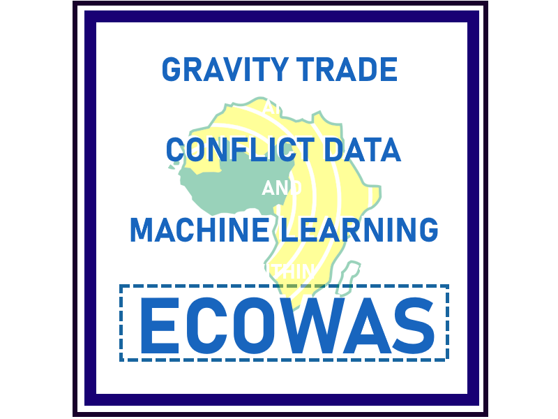

# Expanding gravity theory using machine learning models withconflict data for trade flow prediction within ECOWAS

Welcome to the repo for the ECOWAS conflict trade flow prediction project! Please see a full rundown of actions to run the scripts below:

01. Download the necessary data: https://drive.google.com/drive/folders/1QDy30BzTSirBh7ndpf0HgvnI_bYFeVLU
  
In case the Google Drive dies, the data consists of:
    
  ACLED conflict data exported from their "Data Export Tool" for all conflict types since 1997 in Africa
    
  The 2022 Gravity data from CEPII that is available from CEPII's homepage at: https://www.cepii.fr/CEPII/en/bdd_modele/bdd_modele_item.asp?id=8

02. Change the file paths to the downloaded datasets above in the file 01_EDA.py function called run_all().

03. Execute the scripts 01_EDA.py, 02_synthetic_data.py and 03_modelling.py

04. Enjoy!

For any questions or enquiries, you can reach us at mathm@itu.dk or zere@itu.dk

Credit:
Repo for the bachelor project of Zen Al Aabden Ammar Rehda and Mathias Helmuth Mortensen for the 2026 spring semester at ITU. 
